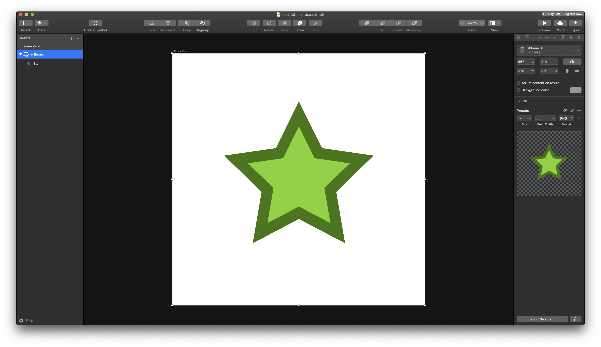
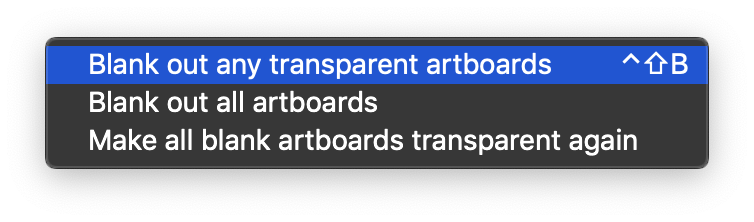
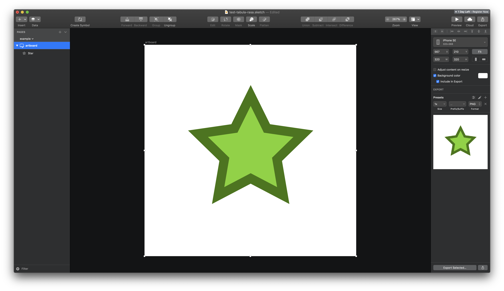

# Tabula Rasa

> Add blank backgrounds to transparent artboards in Sketch

In Sketch, artboards have transparent backgrounds by default, even though they render white on the canvas. But when uploading artboards to *InVision*, viewing changes in *Abstract*, or otherwise exporting, __the canvas doesn't match what's exported__:

Thanks to a few handy commands:

Your artboards can now be appropriately blank:

__Every new artboard you insert__ will also be blank rather than transparent.

Now you can start your designs from a truly blank slate.

## Installation

- [Download](../../releases/latest/download/tabula-rasa.sketchplugin.zip) the latest release of the plugin
- Un-zip
- Double-click on tabula-rasa.sketchplugin

## Tip Jar

Support more Sketch plugins (or just send me a :coffee:) https://paypal.me/artvankilmer